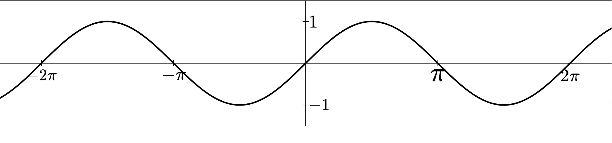

# yapl
Experimental SVG plotting library with focus on mathematical exposition.


```rust
use yapl::codegen_svg::{codegen_svg_cplane, DefaultSVGGlobalStyles};
use yapl::elements::{CoordinatePlane, Function};
use yapl::math::{ClosedInterval, NonDecreasing};

fn main() -> std::io::Result<()> {
    let mut cplane = CoordinatePlane::new_minimal();
    cplane.extent.brect.y = ClosedInterval::new(NonDecreasing::new(-1.1, 1.1));
    cplane.extent.brect.x = ClosedInterval::new(NonDecreasing::new(-0.5, 0.5));
    cplane.extent.x_scale = 10.0;

    let mut f = Function::new_default(|x| (1.0 / x).sin());
    f.zero_tolerance_factor = 10.0f32.powi(7);
    cplane.fns.push(f);
      
    let mut out = std::fs::OpenOptions::new()
        .write(true)
        .create(true)
        .truncate(true)
        .open("out.svg")?;

    let global_styles = DefaultSVGGlobalStyles::new();    
    codegen_svg_cplane(&mut out, &cplane, &global_styles)?;
    
    println!("Done");
    return Ok(())   
}
```

The end-goal of this library is to be a less-featureful replacement for 
[JSXGraph](https://jsxgraph.uni-bayreuth.de/wp/index.html).

However, that goal is a long way from being realized. At the moment this library
provides little more than a linear interpolation algorithm.

## Features

### Axis 

```rust
use std::f64::consts::PI;
use yapl::codegen::{DefaultGlobalStyles, codegen_cplane};
use yapl::elements::{CoordinatePlane, Axis, TickLabel, SymbolicTickLabel};
use yapl::elements::Function;
use yapl::math::{NonDecreasing, ClosedInterval};
use yapl::typesetting::MathJaxProcessTexRenderer;

fn main() -> std::io::Result<()> {
    let mut cplane = CoordinatePlane::new_elementary();
    let mut x_axis = Axis::new_default(0.0, PI, 0.0);
    x_axis.tick_label = Some(TickLabel::Symbolic(SymbolicTickLabel {
        offset_symbol_tex: None,
        stride_symbol_tex: "\\pi".to_string(),
    }));
    cplane.horizontal_axis = Some(x_axis);
    cplane.extent.brect.x = ClosedInterval::new(NonDecreasing::new(-2.0 * PI - 1.0, 2.0 * PI + 1.0));
    cplane.extent.brect.y = ClosedInterval::new(NonDecreasing::new(-1.5, 1.5));

    let mut f = Function::new_default(|x| x.sin());
    cplane.fns.push(f);
      
    let mut out = std::fs::OpenOptions::new().write(true).create(true).truncate(true).open("out.svg")?;

    let global_styles = DefaultGlobalStyles::new();   
    let tex_renderer = MathJaxProcessTexRenderer::new("mathjax-wrapper/main.mjs".to_string());
    codegen_cplane(&mut out, &cplane, &global_styles, &tex_renderer)?;
    println!("Done");
    return Ok(())   
}
```

## To Do 
- Draw grid.
- Draw axis labels.
- Draw labeled points of interest.
- Draw labeled line segments.
- Draw basic shapes.
- Compile to WASM and expose an API to Javascript.
- Create interactive demonstration by implementing desmos-like webapp.
