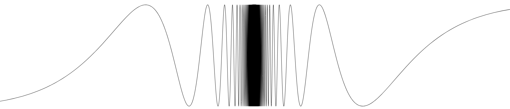

# yapl
Experimental SVG plotting library with focus on mathematical exposition.



```rust
use yapl3::codegen_svg::{codegen_svg_cplane, DefaultSVGGlobalStyles};
use yapl3::elements::{CoordinatePlane, Function};
use yapl3::math::{ClosedInterval, NonDecreasing};

fn main() -> std::io::Result<()> {
    let mut cplane = CoordinatePlane::new_minimal();
    cplane.extent.brect.y = ClosedInterval::new(NonDecreasing::new(-1.1, 1.1));
    cplane.extent.brect.x = ClosedInterval::new(NonDecreasing::new(-0.5, 0.5));
    cplane.extent.x_scale = 10.0;

    let mut f = Function::new_default(|x| (1.0 / x).sin());
    f.zero_tolerance_factor = 10.0f32.powi(7);
    cplane.fns.push(f);
      
    let mut out = std::fs::OpenOptions::new()
        .write(true)
        .create(true)
        .truncate(true)
        .open("out.svg")?;

    let global_styles = DefaultSVGGlobalStyles::new();    
    codegen_svg_cplane(&mut out, &cplane, &global_styles)?;
    
    println!("Done");
    return Ok(())   
}
```

The end-goal of this library is to be a less-featureful replacement for 
[JSXGraph](https://jsxgraph.uni-bayreuth.de/wp/index.html).

However, that goal is a long way from being realized. At the moment this library
provides little more than a linear interpolation algorithm.

## To Do 
- Draw tick marks.
- Draw grid.
- Support mathematical typography by integrating with KaTeX.
- Draw axis labels.
- Draw labeled points of interest.
- Draw labeled line segments.
- Draw basic shapes.
- Compile to WASM and expose an API to Javascript.
- Create interactive demonstration by implementing desmos-like webapp.
